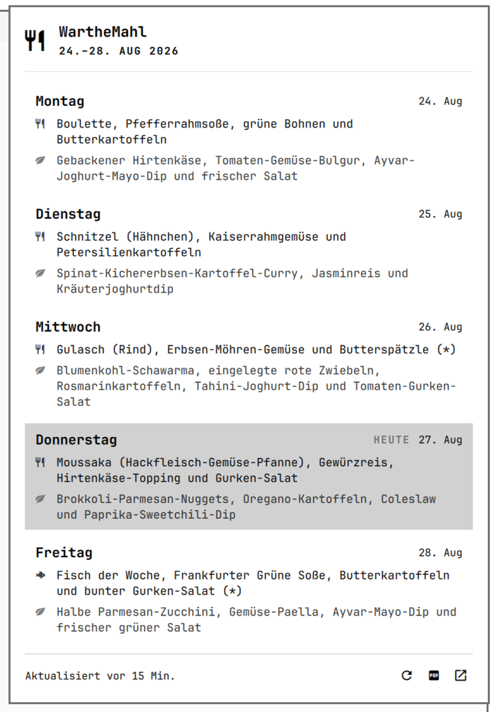

# WartheMahl

Die Wochenspeisekarte von [warthemahl.de](https://warthemahl.de/speisekarte/) als
Bar-Widget für die Omarchy-Shell. Ein Klick auf das Besteck-Icon öffnet die
Gerichte der ganzen Woche, der heutige Tag ist hervorgehoben.



## Installation

```sh
omarchy plugin add https://github.com/likt0r/omarchy-warthemahl.git --enable
```

Omarchy klont das Repo nach `~/.config/omarchy/plugins/likt0r.warthemahl/`,
prüft das Manifest und fragt, wo in der Bar das Icon sitzen soll.

Aktualisieren:

```sh
omarchy plugin update likt0r.warthemahl
```

Das ist ein `git fetch` plus `merge --ff-only` im Plugin-Ordner. Es zeigt den
Diff vor dem Anwenden und **bricht ab, wenn dort unkommittierte Änderungen
liegen**. Wer das Plugin anpassen will, forkt es besser, statt im installierten
Ordner zu editieren.

Entfernen:

```sh
omarchy plugin remove likt0r.warthemahl
```

## Voraussetzungen

- Omarchy 4.x (Quattro) mit der Quickshell-Shell
- `python3` (nur Standardbibliothek, keine pip-Pakete)
- `xdg-open` für die PDF- und Website-Buttons
- Netzzugriff auf `warthemahl.de` — ohne Netz zeigt das Panel den letzten
  zwischengespeicherten Stand

Das Plugin schreibt ausschließlich seinen eigenen Cache nach
`${XDG_CACHE_HOME:-~/.cache}/omarchy/warthemahl-menu.json`. Es verändert keine
Konfiguration; die Platzierung in der Bar nimmt Omarchy beim `plugin add`
selbst vor.

**Inhaltliche Abhängigkeit:** Die Gerichte kommen aus der öffentlichen
Speisekarten-Seite von WartheMahl. Ändert sich deren Seitenaufbau, muss der
Parser nachgezogen werden (siehe *Tests*). Das Plugin fragt die Seite höchstens
stündlich ab und cacht dazwischen.

## Lizenz

MIT, siehe [LICENSE](LICENSE). Die Speisekarten-Inhalte selbst gehören
WartheMahl und werden nur angezeigt, nicht mitgeliefert.

## Bedienung

| Aktion | Wirkung |
|---|---|
| Linksklick auf das Icon | Speisekarte öffnen / schließen |
| Schalter oben rechts | Nur vegetarische Gerichte zeigen |
| Rechtsklick | Neu laden (erzwingt einen Abruf, ignoriert den Cache) |
| Mittelklick | PDF der Woche öffnen |
| `↑` / `↓` | Zwischen den Tagen navigieren |
| `Enter` | PDF öffnen |
| `r` | Neu laden |
| `p` | PDF öffnen |
| `v` | Vegetarier-Filter umschalten |
| `w` | warthemahl.de im Browser öffnen |
| `Esc` | Schließen |
| `Tab` | Zum nächsten Bar-Panel wechseln |

Der Tooltip am Bar-Icon zeigt die heutigen Gerichte, ohne dass man klicken muss.

Der Schalter im Kopf des Panels blendet die Fleisch- und Fischgerichte aus.
Die Einstellung wird in `shell.json` gespeichert, gilt also auch nach einem
Neustart und wirkt ebenso auf den Tooltip am Bar-Icon. Tage ohne vegetarische
Option sagen das ausdrücklich, statt stumm leer zu bleiben.

Pro Tag listet die Seite zwei Gerichte: das Tagesgericht (Besteck-Icon, bei Fisch
ein Fisch-Icon) und die vegetarische Variante (Blatt-Icon). Diese Reihenfolge ist
die Konvention der Website und das einzige verfügbare Signal — es gibt keine
Auszeichnung im HTML, an der man es sonst festmachen könnte.

## Aufbau

```
manifest.json          Plugin-Metadaten und Einstellungs-Schema
Panel.qml              Bar-Button + Popup (der einzige Einstiegspunkt)
Model.js               Reine Hilfsfunktionen: Datum, Icons, Statustexte
bin/warthemahl-menu    Holt und parst die Seite, gibt JSON aus, cacht das Ergebnis
tests/                 node --test für Model.js, unittest für den Parser
```

Das HTML-Parsing liegt bewusst im Python-Helfer und nicht in QML: so lässt es
sich gegen eine gespeicherte Kopie der echten Seite testen, und eine Änderung an
der Website ist zu beheben, ohne das Panel anzufassen.

Der Helfer gibt **immer** genau ein JSON-Objekt aus und endet mit Status 0. Ist
die Seite nicht erreichbar, liefert er den zwischengespeicherten Stand mit
`stale: true` — eine etwas alte Karte ist nützlicher als ein leeres Panel. Das
Panel zeigt dann „Offline · Stand vor …" und ein `OFFLINE`-Abzeichen.

Cache: `${XDG_CACHE_HOME:-~/.cache}/omarchy/warthemahl-menu.json`

## Einstellungen

In `~/.config/omarchy/shell.json` am Eintrag des Widgets:

```json
{ "id": "likt0r.warthemahl", "refreshIntervalSec": 3600, "vegetarianOnly": false }
```

`vegetarianOnly` (Standard `false`) entspricht dem Schalter im Panel — das
Umschalten dort schreibt genau diesen Wert zurück.

`refreshIntervalSec` (Standard 3600) bestimmt, wie alt der Cache sein darf, bevor
beim Öffnen neu geladen wird. Ein erzwungenes Neuladen (Rechtsklick, `r`) umgeht
das immer.

## Position in der Bar

```bash
omarchy bar move likt0r.warthemahl --section center --after omarchy.weather
omarchy bar move likt0r.warthemahl --section right --index 0
```

## Optionale Tastenkombination

In `~/.config/hypr/bindings.lua`:

```lua
o.bind("SUPER CTRL", "M", "Speisekarte", "omarchy-shell likt0r.warthemahl toggle")
```

## Steuerung von außen

```bash
omarchy-shell likt0r.warthemahl toggle    # Panel umschalten
omarchy-shell likt0r.warthemahl refresh   # Neu laden erzwingen
omarchy-shell likt0r.warthemahl status     # Heutige Gerichte auf stdout
omarchy-shell likt0r.warthemahl vegetarian # Vegetarier-Filter umschalten
```

## Tests

```bash
cd ~/.config/omarchy/plugins/likt0r.warthemahl
node --test tests/model.test.js
python3 -B -m unittest discover -s tests
```

`-B` ist kein Detail: ohne das legt Python ein `__pycache__` im Plugin-Ordner an,
und der Dateiwächter der Shell lädt daraufhin jedes Mal das Plugin neu.

Die Parser-Tests laufen gegen `tests/fixtures/speisekarte.html`, eine echte Kopie
der Seite. Ändert WartheMahl das Seitenlayout, ist der erste Schritt: neue Kopie
ziehen, Test laufen lassen, `parse()` nachziehen.

```bash
curl -sL https://warthemahl.de/speisekarte/ -o tests/fixtures/speisekarte.html
```

## Hinweis

Die Speisekarte wird von WartheMahl im Lauf der Woche aktualisiert. Passt die
veröffentlichte Woche nicht zum heutigen Datum, sagt das Panel das ausdrücklich
(„Wochenende · neue Karte ab Montag", „Nicht mehr aktuell · Karte vom …"), statt
eine alte Karte kommentarlos als aktuell auszugeben.

## Für Mitentwickler

Der Ablauf für eine Änderung:

1. Ändern, `node --test tests/model.test.js` und `python3 -B -m unittest discover -s tests`
2. `omarchy plugin validate .` — dieselbe Prüfung, die bei `plugin add` läuft
3. `manifest.json` → `version` hochzählen
4. Committen, `git tag vX.Y.Z`, pushen

Der Release-Workflow lehnt einen Tag ab, der nicht zur Version im Manifest
passt — der Tag ist das, worauf Nutzer sich verlassen, und ein stiller
Versatz zwischen beiden wäre eine falsche Angabe.

Die Tests laufen ohne Netz: der Parser arbeitet gegen
`tests/fixtures/speisekarte.html`, und die Cache-Tests erzwingen den
Netzwerkfehler über einen toten Proxy. Damit ist CI weder von WartheMahls
Erreichbarkeit noch von deren Speiseplan abhängig.
